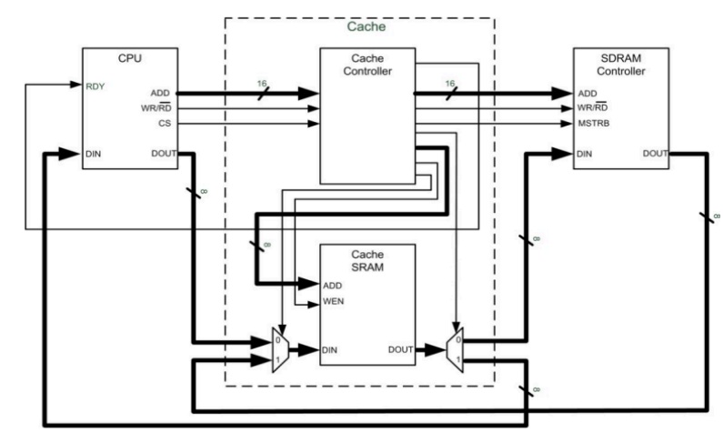
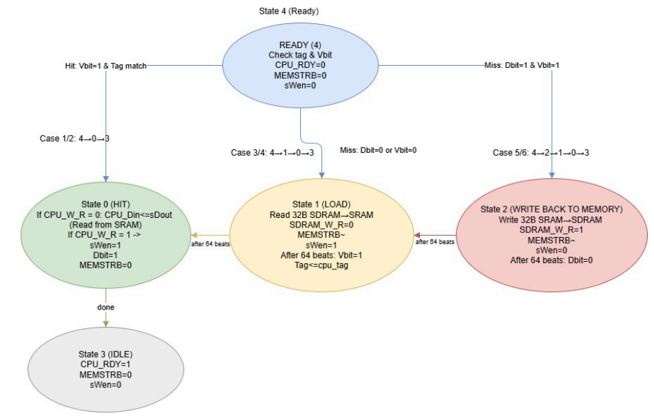
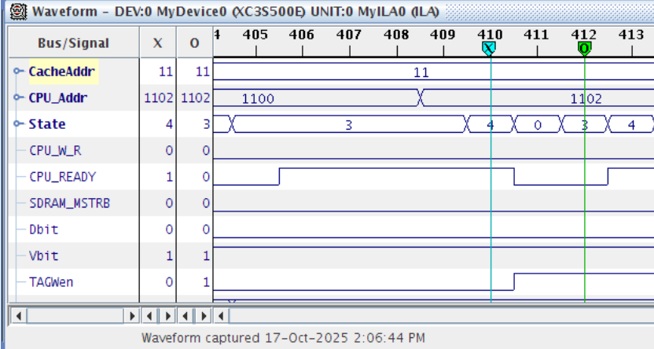
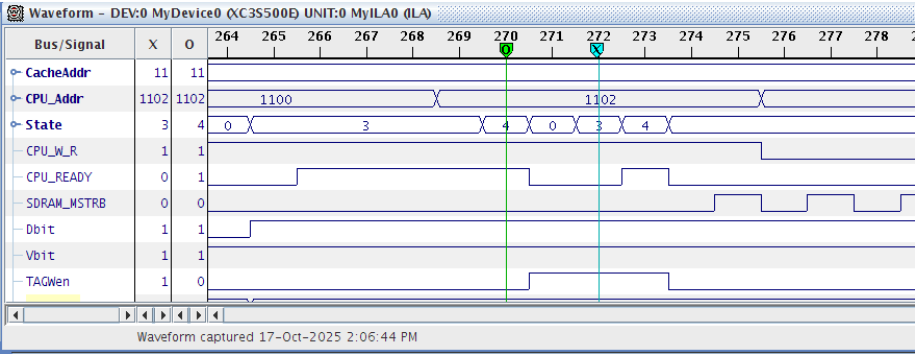
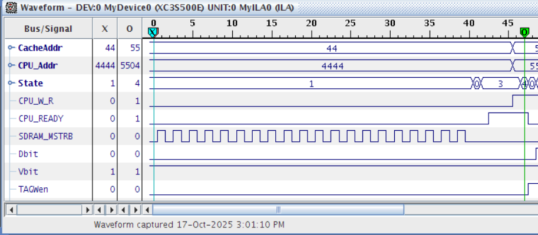
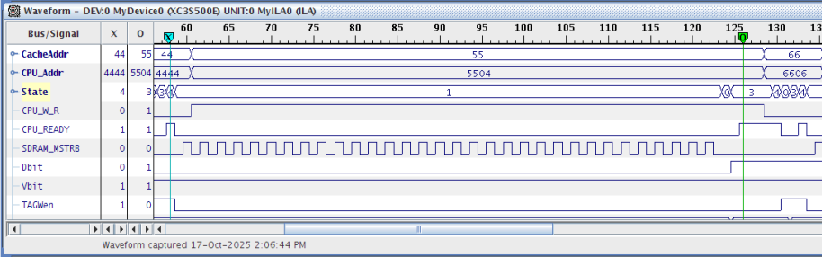
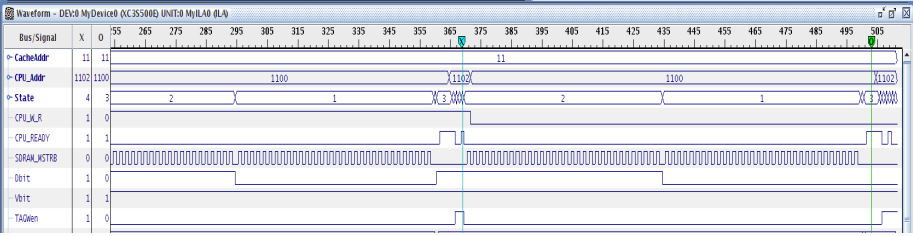
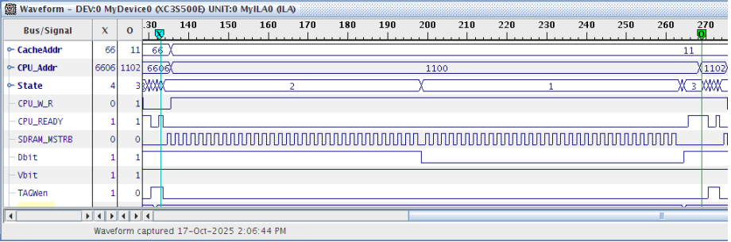

# Cache Controller

A simplified cache controller designed in **VHDL** for a memory hierarchy system using a CPU transaction generator, local SRAM cache, and SDRAM main memory. The controller determines whether each CPU read/write request is a cache hit or miss, then performs the required SRAM or SDRAM operation using a finite state machine.

## Project Overview

This project implements a cache controller that sits between a CPU and main memory. The CPU issues read and write requests through a 16-bit address bus, while the cache controller checks the tag, valid bit, and dirty bit to decide whether the requested data is already in cache.

If the request is a **hit**, the controller reads from or writes to the local SRAM cache. If the request is a **miss**, the controller either loads a new 32-byte block from SDRAM or writes back a dirty block before loading the new block.

---

## System Architecture

The design is made of four main blocks:

- **CPU Generator (`CPU_gen.vhd`)** - generates read/write requests using preset address and data patterns.
- **Cache Controller (`CacheController.vhd`)** - main FSM that controls hit/miss detection, block loading, write-back, and ready signalling.
- **Cache SRAM (`SRAM.vhd`)** - local high-speed cache storage.
- **SDRAM Controller (`SDRAMController.vhd`)** - main memory interface used during cache misses and write-backs.

---

## Cache Organization

The CPU address is 16 bits and is divided as:

| Field | Bits | Purpose |
|---|---:|---|
| Tag | `[15:8]` | Identifies the memory block stored in cache |
| Index | `[7:5]` | Selects one of 8 cache blocks |
| Offset | `[4:0]` | Selects one byte inside a 32-byte block |

Cache size:

- **8 cache blocks**
- **32 bytes per block**
- **256 bytes total**
- **1 byte per word**

---

## Finite State Machine

The cache controller uses a five-state FSM:

| State | Name | Function |
|---|---|---|
| `state4` | READY | Check tag, valid bit, and dirty bit |
| `state0` | HIT | Complete read/write using cache SRAM |
| `state1` | LOAD | Load a 32-byte block from SDRAM to SRAM |
| `state2` | WRITE-BACK | Write a dirty cache block from SRAM to SDRAM |
| `state3` | IDLE | Assert `CPU_RDY` and wait for the next CPU request |

---

## Behavioural Cases

| Case | Operation | Condition | State Sequence | Memory Activity |
|---|---|---|---|---|
| 1 | Read Hit | `CPU_W_R=0`, `Vbit=1`, tag match | `4 -> 0 -> 3` | SRAM read only |
| 2 | Write Hit | `CPU_W_R=1`, `Vbit=1`, tag match | `4 -> 0 -> 3` | SRAM write only, `Dbit=1` |
| 3 | Read Miss, clean block | Miss, `Dbit=0` | `4 -> 1 -> 0 -> 3` | Load block from SDRAM |
| 4 | Write Miss, clean block | Miss, `Dbit=0` | `4 -> 1 -> 0 -> 3` | Load block, then write CPU data to SRAM |
| 5 | Read Miss, dirty block | Miss, `Dbit=1` | `4 -> 2 -> 1 -> 0 -> 3` | Write-back old block, load new block, return data |
| 6 | Write Miss, dirty block | Miss, `Dbit=1` | `4 -> 2 -> 1 -> 0 -> 3` | Write-back old block, load new block, write CPU data |

---

## Key Control Signals

| Signal | Direction | Description |
|---|---|---|
| `CPU_CS` | CPU -> Cache Controller | CPU strobe indicating a valid request |
| `CPU_RDY` | Cache Controller -> CPU | Indicates the controller is done and ready |
| `CPU_W_R` | CPU -> Cache Controller | `0` = read, `1` = write |
| `sWen` | Cache Controller -> SRAM | SRAM write enable |
| `SDRAM_MSTRB` / `MEMSTRB` | Cache Controller -> SDRAM | Pulses once per byte transfer |
| `Vbit` | Internal | Marks a cache line as valid |
| `Dbit` | Internal | Marks a cache line as modified/dirty |
| `TAGWen` | Internal/debug | Indicates tag validation/update activity |

---

## Waveform Results

The design was verified using ChipScope/ILA waveform captures. The most important signal to watch during misses is `SDRAM_MSTRB`: one burst indicates a clean miss load, while two bursts indicate a dirty miss with write-back followed by load.

### Case 1 - Read Hit

The CPU issues a read request. Since the valid bit is set and the tag matches, the controller reads data from SRAM and sends it to the CPU. `MEMSTRB` remains low because SDRAM is not accessed.

### Case 2 - Write Hit

The CPU writes data to an address already present in cache. The controller writes the CPU data into SRAM and sets the dirty bit to indicate that the cache line has been modified.

### Case 3 - Read Miss, Dbit = 0

The requested block is not in cache, but the current cache line is clean. The controller loads a 32-byte block from SDRAM into SRAM, updates the tag and valid bit, then returns the requested data.

### Case 4 - Write Miss, Dbit = 0

The requested block is not in cache, and the current cache line is clean. The controller loads the full block from SDRAM into SRAM, updates the tag and valid bit, then writes the CPU data to the cache.

### Case 5 - Read Miss, Dbit = 1

The requested block is not in cache, and the current cache line is dirty. The controller first writes the old dirty block back to SDRAM, then loads the new block from SDRAM into SRAM. After the load finishes, the read data is sent to the CPU.

### Case 6 - Write Miss, Dbit = 1

The requested block is not in cache, and the current cache line is dirty. The controller writes the old block back to SDRAM, loads the new block, then writes the CPU's data into the cache and marks the line dirty again.

---

## Performance Summary

| Cache Performance Parameter | Time |
|---|---:|
| Hit/Miss Determination Time | 10 ns |
| Data Access Time | 20 ns |
| Block Replacement Time | 640 ns |
| Hit Time (Cases 1 and 2) | 60 ns |
| Miss Penalty, `Dbit=0` (Cases 3 and 4) | 710 ns |
| Miss Penalty, `Dbit=1` (Cases 5 and 6) | 1350 ns |

The system used a **50 MHz clock**, giving a **20 ns CPU period**.

---

## How to Open the Project

1. Open **Xilinx ISE**.
2. Load the project file (`.xise`) or create a new project and add the VHDL source files.
3. Include the SRAM IP wrapper and ChipScope cores if running on hardware.
4. Assign the clock pin using the provided `.ucf` constraint.
5. Synthesize, implement, generate bitstream, and inspect waveforms using ChipScope/ILA.

---

## Tools Used

- VHDL
- Xilinx ISE
- Xilinx ChipScope / ILA
- Spartan-3E FPGA target (`XC3S500E`)
- BlockRAM SRAM IP
- SDRAM controller model

---

## Notes

- `CPU_gen.vhd` is a transaction generator used to test the cache controller.
- `MEMSTRB` pulses once per byte transfer.
- A 32-byte block transfer requires 32 `MEMSTRB` pulses.
- Dirty misses require two block transfers: write-back followed by load.
- `CPU_Din` is only meaningful for read operations; write operations use `CPU_Dout`.

---

## License

This repository is for academic and portfolio use. If you reuse this project, follow your institution's academic integrity policy and do not submit it as your own work.
